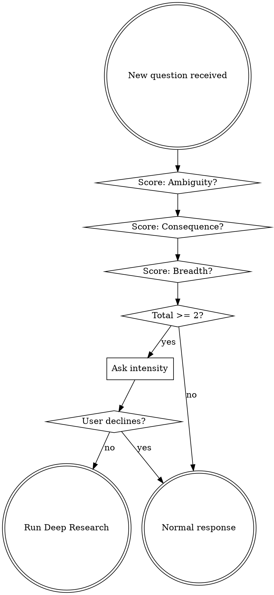

# Deep Research — Adversarial Multi-Agent Analysis

## Overview

Deep Research explores a question from multiple genuinely distinct schools of thought using parallel advocate/critic agent pairs, then synthesizes what survived into a layered executive brief. Every layer is adversarially stress-tested. No unexamined conclusions.

**Core principle:** Reasoning models add inflection points to a single line. We add multiple lines.

## When to Use



**Score the question on three binary axes:**

| Axis | Score 1 if... | Score 0 if... |
|------|--------------|--------------|
| **Ambiguity** | Multiple valid interpretations or approaches exist | Single clear answer or method |
| **Consequence** | Getting it wrong has significant downstream impact (architecture, strategy, hiring) | Low-stakes, easily reversible |
| **Breadth** | Meaningfully distinct schools of thought exist | One established best practice |

**Activation:** 2+ axes score 1.

**When activated, ask:**

> **This looks like it'd benefit from deep research. How hard should I go?**
> - **Light** (3 directions, ~8 agents)
> - **Standard** (5 directions, ~12 agents)
> - **Heavy** (8+ directions, ~18+ agents)

If the user says "just answer," "skip," or similar — stand down immediately and respond normally.

## Orchestration Flow

Once the user picks intensity:

### Step 0 — Propose Directions

Analyze the question and propose N directions. Each direction is a genuinely distinct *lens* or *school of thought* — not variations on the same idea.

Present them as a numbered list:

> **Proposed directions:**
> 1. [Lens name] — [one-line description]
> 2. [Lens name] — [one-line description]
> ...
>
> **Swap any out, add one, or thumbs up to run.**

Wait for user confirmation before proceeding.

### Step 1 — Wave 1: Advocates (parallel)

Read `advocate-prompt.md` from this skill directory. For each direction, launch an Agent with:
- `subagent_type`: not set (general-purpose)
- `run_in_background`: `true` for all except the last one (to allow parallel execution while waiting)
- `description`: "Advocate: [direction name]"
- `prompt`: The advocate prompt template with `{{QUESTION}}`, `{{DIRECTION_NAME}}`, and `{{DIRECTION_DESCRIPTION}}` replaced with actual values

Launch ALL advocate agents in a single message (multiple Agent tool calls) so they run in parallel.

Wait for all advocates to complete. Store each output.

### Step 2 — Wave 2: Critics (parallel)

Read `critic-prompt.md` from this skill directory. For each advocate output, launch an Agent with:
- `description`: "Critic: [direction name]"
- `run_in_background`: `true` for all except the last
- `prompt`: The critic prompt template with `{{QUESTION}}`, `{{DIRECTION_NAME}}`, and `{{ADVOCATE_OUTPUT}}` replaced with actual values

Launch ALL critic agents in a single message. Wait for all to complete.

### Step 3 — Orchestrator (sequential)

Read `orchestrator-prompt.md`. Launch a single Agent with:
- `description`: "Orchestrator: synthesize debates"
- `prompt`: The orchestrator prompt template with `{{QUESTION}}` and `{{DEBATES}}` replaced. `{{DEBATES}}` is formatted as:

```
## Direction 1: [Name]
### Advocate
[advocate output]
### Critic
[critic output]

## Direction 2: [Name]
...
```

Wait for completion. Store output.

### Step 4 — Meta-Steelman (sequential)

Read `meta-steelman-prompt.md`. Launch a single Agent with:
- `description`: "Meta-steelman: challenge synthesis"
- `prompt`: The meta-steelman prompt template with `{{QUESTION}}`, `{{ORCHESTRATOR_OUTPUT}}`, and `{{DEBATE_SUMMARY}}` replaced

Wait for completion.

### Step 5 — Deliver Layered Output

Format and present to the user:

```
## Verdict
[3 lines max from orchestrator, amended by meta-steelman if it found issues]

## Surviving Arguments
[2-4 arguments that held up under criticism. Each: claim, what critic threw at it, why it held]

## Killed Arguments
[Directions that got dismantled. One line each: what was argued, how it broke]

## Meta-Critique
[Meta-steelman's take on the synthesis — what might be wrong with the conclusion]

---
*Deep Research: [N] directions explored, [2N+2] agents, [intensity] intensity.*
*Ask "show me the full debate on direction [N]" for raw advocate/critic exchange.*
```

If the user asks for a raw debate, print the stored advocate + critic output for that direction.

## Intensity Reference

| Intensity | Directions | Advocates | Critics | Orchestrator | Meta-Steelman | Total |
|-----------|-----------|-----------|---------|-------------|---------------|-------|
| Light | 3 | 3 | 3 | 1 | 1 | 8 |
| Standard | 5 | 5 | 5 | 1 | 1 | 12 |
| Heavy | 8+ | 8+ | 8+ | 1 | 1 | 18+ |

## Red Flags — You're Doing It Wrong

- Proposing directions that are variations of the same idea, not distinct lenses
- Skipping the user direction-confirmation step to save time
- Running critics without the advocate's actual output (Wave 2 MUST be sequential after Wave 1)
- Delivering all raw debate output instead of the layered format
- Firing on simple factual questions that scored below the gate threshold
