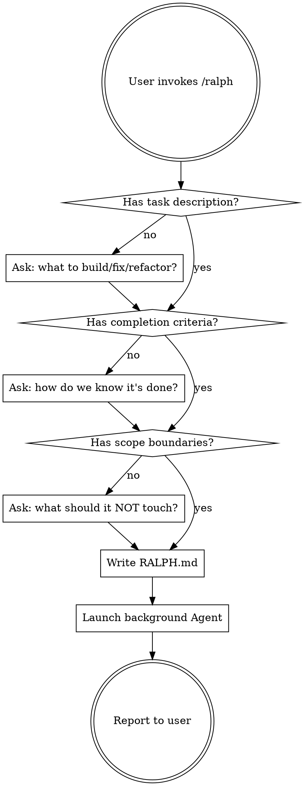

# Ralph Wiggum Loop Launcher

## Overview

Ralph Wiggum is an autonomous iteration loop. This skill helps the user define a task with precise "done" criteria, writes `RALPH.md`, and launches a background Agent to execute it. A global Stop hook re-injects the prompt each time Claude tries to exit, creating a persistent work loop.

> Credit: the "Ralph Wiggum" technique was originated by Geoff Huntley ([ghuntley.com/ralph](https://ghuntley.com/ralph/)). This skill is a thin launcher for it. Anthropic also ships an official `ralph-wiggum` plugin if you want the supported version.

## Workflow



## Three Things You Need From the User

1. **Task**: What to build, fix, or refactor. Be specific about the project directory.
2. **Done criteria**: Measurable exit conditions (tests pass, types check, lint clears, specific behavior works). The more precise, the better the loop performs.
3. **Boundaries**: What NOT to touch. Files, directories, or behaviors that are off-limits.

If the user provides all three upfront (e.g., `/ralph build a REST API in ~/Projects/my-app with full test coverage, don't touch the frontend`), skip the questions and go straight to writing.

## Writing RALPH.md

Write `RALPH.md` in the target project's root directory. Use this structure:

```markdown
# Task
[Clear description of what to accomplish]

# Completion Criteria
- [ ] [Specific, verifiable criterion 1]
- [ ] [Specific, verifiable criterion 2]
- [ ] All tests pass (`npm test` / `pytest` / etc.)
- [ ] No type errors (`npx tsc --noEmit` / `mypy` / etc.)
- [ ] No lint errors (`npm run lint` / `ruff check` / etc.)

# Boundaries
- Do NOT modify: [files/dirs]
- Do NOT add: [unwanted dependencies/patterns]

# Verification
Before stopping, run these commands and confirm they all pass:
1. [test command]
2. [typecheck command]
3. [lint command]

If any verification fails, fix the issue and re-verify. Do not stop until all pass.
```

## Launching the Agent

After writing RALPH.md, launch a **background Agent** with:
- The full content of RALPH.md as the prompt
- `run_in_background: true` so the user can keep working
- A clear description like "Ralph: [short task summary]"

The agent will work autonomously. The global Stop hook will re-inject the prompt if RALPH.md still exists when the agent tries to exit.

## Stopping the Loop

Tell the user: "To stop the loop, delete or rename RALPH.md in the project directory."

## Key Principles

- **Prompt quality is everything.** Vague prompts produce vague loops. Push the user for specificity.
- **Verification commands are mandatory.** Every RALPH.md must end with concrete commands to run.
- **Boundaries prevent drift.** Without them, the loop may refactor things the user didn't ask for.
